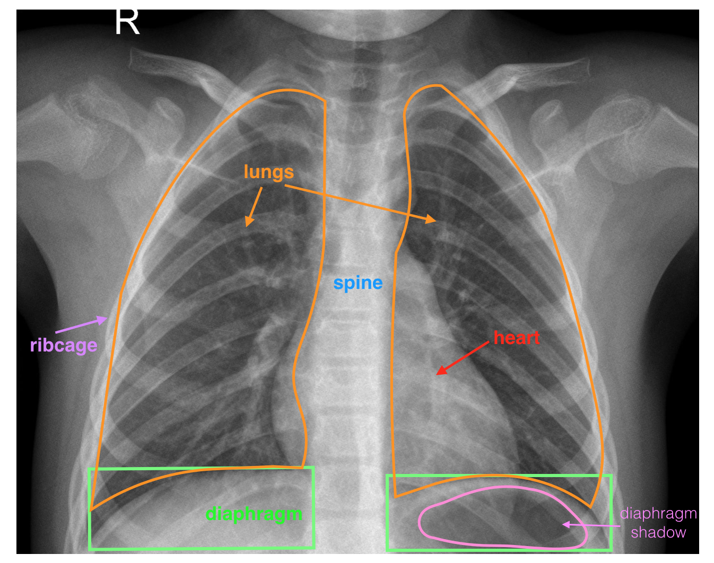
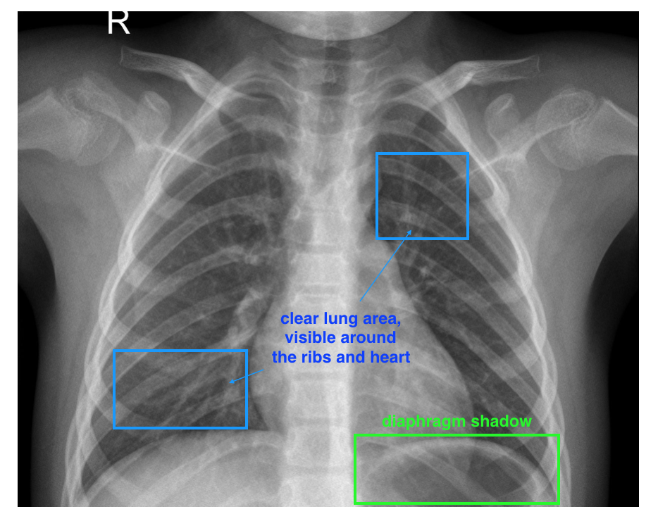
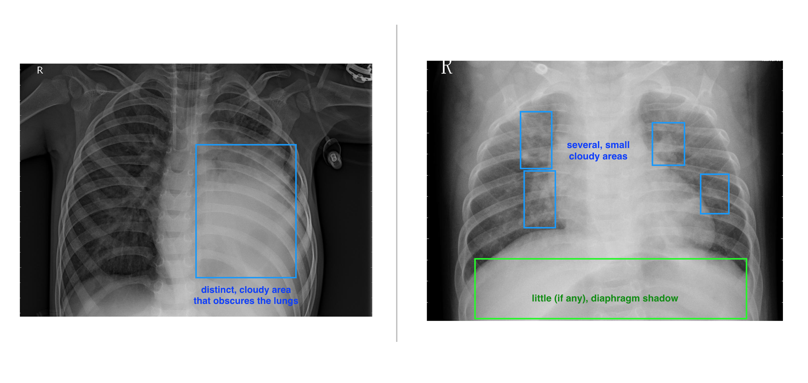
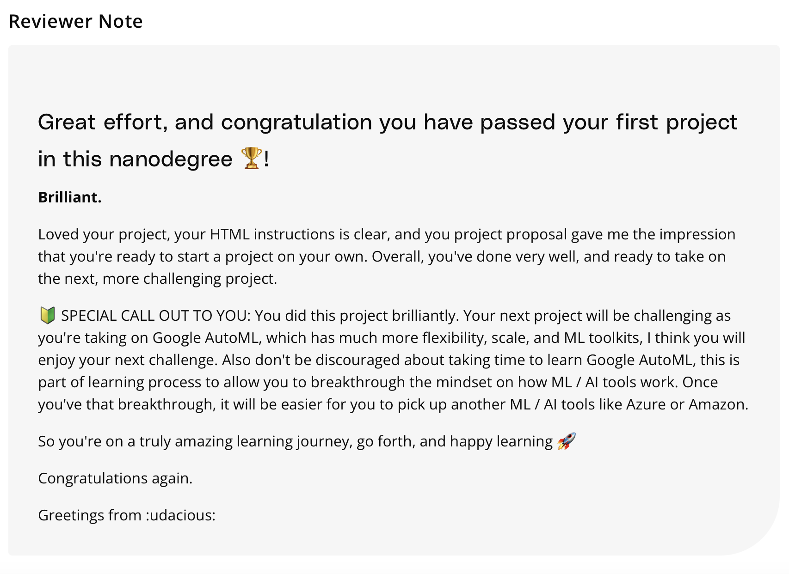

# Nanodegree: AI Product Management 🎓

This repository tracks my journey as I progress through the [Udacity Nanodegree in AI Product Management](https://www.udacity.com/course/ai-product-manager-nanodegree--nd088). 

The course provides a comprehensive overview of how AI technologies can enhance and inform product management. It covers everything from creating datasets and building models, to measuring impact and continuously updating models.

 

## Course Layout 📚 

### 🌟 Introduction to AI in Business

In this module, we delve into the fascinating world of AI and its applications in business. We learn how AI technologies can analyze and learn from data, leading to improved decision-making and more effective product management. 

### 📝 Creating Datasets

In this part of the course, we explore how to build custom datasets, which form the foundation of machine learning models. We also learn how to annotate datasets effectively to ensure accurate and meaningful results.

#### skills:
- Dataset building
- Data fit & annotation
- Data cleaning
- Job design
- CML
- Result auditing
- Planning for failure & longevity

### 🧠 Building Models

This module introduces us to the process of training and evaluating neural networks, which are at the heart of many AI technologies. We also learn about automated machine learning tools that can simplify and accelerate the model-building process.

#### skills:
- Modeling
- Neural networks
- Neural architecture search
- Activation functions
- Back propagation
- Multi-layer perceptrons
- Convolutional neural networks
- Long-short term memory (LSTM) networks
- Training data / validation data / test data
- Model evaluation
- precision / recall / F1 score
- Transfer learning
- Automated Machine learning (AutoML)
- Cloud Solutions

### 📈 Measuring Impact and Updating Models

In the final part of the course, we learn how to improve machine learning models and AI products. We discuss strategies to mitigate bias and explore how to scale AI/ML products. The module also covers the importance of continuously updating models to ensure they remain effective and relevant.

 

## Course Projects 🏗️

### 🩻 Project: Create a Medical Image Annotation Job

In this project, we designed a product aimed at assisting doctors in quickly identifying cases of pneumonia in children. The goal was to develop a classification system that could:

- Flag serious cases
- Quickly identify healthy cases
- Act as a diagnostic aid for doctors

We started by building a labeled dataset capable of distinguishing between healthy and pneumonia x-ray images. This dataset would later serve as a foundation for machine learning engineers to construct a classification product.

We used the [Chest x-ray dataset](https://www.kaggle.com/datasets/paultimothymooney/chest-xray-pneumonia), with labels removed, and every data point is a chest x-ray image. The images vary in size and exposure times.

  
A typical, labeled image is shown below:

  

 

The challenge in this project lies in the fact that it is not always clear when pneumonia symptoms are present in an image. Thus, the system is not intended to replace a doctor, but rather to aid in quickly identifying healthy patients and highlighting potential cases of pneumonia.

To address this challenge, we designed a data annotation job suitable for a non-expert to identify more noticeable cases of pneumonia. We planned for uncertainty in data labels and incorporated test questions to capture this uncertainty.

Below are some visual examples demonstrating the characteristics of a healthy image and symptoms of pneumonia:

  
Characteristics of a healthy image: a clear lung area.

  

 

  
Examples of pneumonia symptoms: (Left) a concentrated, opaque area in the lungs, (Right) multiple, smaller opaque areas throughout the lung area and any diaphragm shadow is obscured:

  

 

Our main deliverables for this project were an HTML file of a complete job Preview, which includes instructions for annotation and example test questions, and a Proposal document discussing the job's design and quality assurance steps.

In our annotator instructions, we acknowledged the challenging nature of the classification task and provided clear examples and instructions to potential annotators. We offered an 'Unknown' or 'Other' option to account for uncertainty in an annotation and allowed annotators to indicate their confidence level in the presence of pneumonia symptoms on a numerical scale.

This project was a valuable experience in dataset creation, annotation job design, handling uncertainty, and planning for quality assurance.

 

  
feedback we received from the reviewer on this project:

  

 

## Course Context

I am currently pursuing these courses to broaden and deepen my skill set as a Data Scientist/AI Expert, enhancing my T-shaped profile. As I find myself taking up more responsibities towards tasks entailing more project and product management, I have curated a path of learning to equip myself with the relevant skills and knowledge. This learning journey is outlined as follows:

#### ✅ Product Manager Nanodegree
The [Product Manager Nanodegree programme](https://www.udacity.com/course/product-manager-nanodegree--nd036) will equip you with the foundational skills to assume entry-level product manager roles. You’ll learn directly from experienced Product Managers at Uber and Google, who have constructed this Nanodegree program to equip you with the most in-demand and relevant industry skills. This Nanodegree program teaches the core skill set required in all Product Manager roles, which is the foundation for more specialized roles like Growth Product Manager, Data Product Manager, AI Product Manager, and more.

##### Prerequisite knowledge:
- General understanding of the product development lifecycle
- Familiarity with different roles required to build a product
- Familiarity with Google Workspace and/or Microsoft Office Applications

#### ✅ AI Product Manager Nanodegree
The [AI Product Manager Nanodegree programme](https://www.udacity.com/course/ai-product-manager-nanodegree--nd088) is meant for product managers that are responsible for building and deploying AI products. The AI PM Nanodegree program is focused on the hands-on tasks of scoping a data set, training a model, and evaluating the performance of the model.

##### Prerequisite knowledge:
- Product management
- Data analysis
- AI/ML algorithms

#### ✅ Data Product Manager Nanodegree
The [Data Product Manager Nanodegree programme](https://www.udacity.com/course/data-product-manager-nanodegree--nd030) is meant for experienced Product Managers who are looking to specialize their skills in product management and be equipped to fill data-focused roles in the development and strategy behind data products. You'll learn how to build an MVP launch strategy for a new service product that utilizes market insights extracted from extensive data analyses and visualizations, develop a data model with corresponding data pipelines and transformations to evaluate user activity of a product, and identify key behavioral and descriptive attributes of users to construct hypotheses for new product features and experiments to validate these hypotheses.

##### Prerequisite knowledge:
- Data Analysis
- Product Management
- Big data
- Database
- AI/ML Algorithms 

#### ⏳ Growth Product Manager Nanodegree (in consideration)
The [Growth Product Manager Nanodegree programme](https://www.udacity.com/course/growth-product-manager-nanodegree--nd037) is meant for experienced Product Managers who are looking to specialize their skills in product management and be equipped to fill growth-focused roles. You’ll learn how to grow the user base of your product, get customers engaged and activated as quickly as possible, and monetize your product to have it generate revenue.

##### Prerequisite knowledge:
- Experience as a Product Manager
- Experience scoping business requirements
- KPIs
- Data/statistical analysis
- Excel/Spreadsheets
